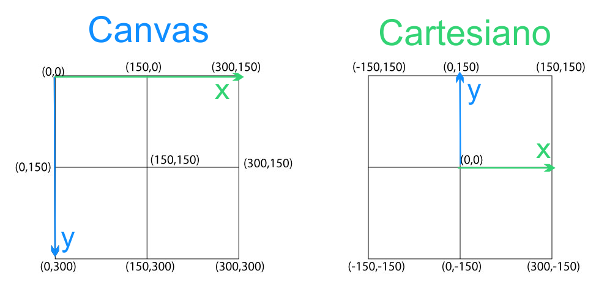

# Trabalho de Cálculo 2 - Construção de um emoji com movimento

## Autor: Jadson Pereira

### Ambiente:
- Linguagem de programação: JavaScript
- [Visual Studio Code](https://code.visualstudio.com/)
- Windows 10

## Emoji
O objetivo do trabalho é relacionar os assuntos ligados à <b>Cálculo Diferencial</b> e <b>Integral</b> com programação, verificando que curvas paramétricas e coordenadas polares podem ser implementadas para gráficos de curvas não usuais e com movimentos.
 
O Trabalho consiste em utilizar <b>curvas paramétricas</b>, <b>coordenadas polares</b> ou <b>superfícies cônicas</b>, ou ambas para obter a Construção de um emoji com movimento.

## Teoria

## Referências
Função Sleep no JS. 
https://flaviocopes.com/javascript-sleep/ 
(Visto em: 05/07/2019) 

 Pure CSS Smily Face - Css3 Hover Effect - Html5 Css3 Tutorials For Beginners - Css Animated Shape  
https://www.youtube.com/watch?v=-SSHNZIFeKs 
(Visto em: 05/07/2019) 

Smiley HTML Canvas Tutorial | Part 2: Circles and Ellipses 
https://www.youtube.com/watch?v=78NyTc40Xgo&t=264s 
(Visto em: 05/07/2019) 

HTML canvas arc() Method 
https://www.w3schools.com/tags/canvas_arc.asp 
(Visto em: 05/07/2019) 

w3Schol Ellipse 
https://www.w3schools.com/graphics/svg_ellipse.asp 
(Visto em: 05/07/2019) 
